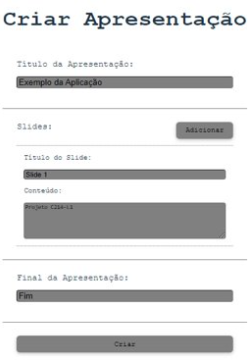
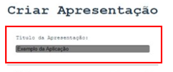
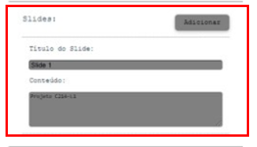
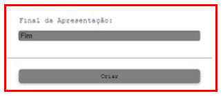

<h1 align="center"> C214 - Laboratório </h1>
<h3 align="center">:books: Projeto: FormPDF </h3>

<p align="center">


</p>

### :speech_balloon: Projeto

FormPDF é um criador de slides que gera o conteúdo da apresentação, informado pelo usuário, em formato PDF.

### :point_right: Pré-requisitos

- Baixar o código no formato zip, clicando no botão Code do Repositório e descompactá-lo ou
- Clonar o repositório, utilizando o terminal Git Bash: 
``` 
$ git clone https://github.com/alvaromfcunha-inatel/c214l1-projeto.git
```
- [NodeJS](https://nodejs.org/en/download/): v16.17 ou superior (recomendado [nvm](https://github.com/nvm-sh/nvm));
- *npm*: v8.15 ou superior;
- Editor de sua escolha. Por exemplo, [VSCode](https://code.visualstudio.com/download)

### :heavy_check_mark: Como executar a aplicação?

- Ir para o diretório do repositório:
```
cd c214l1-projeto/
```

- Instalar as dependências do *node*:
```
npm i
```

- Inicializar o servidor web:
```
npm run dev
```

- Após o comando anterior, para acessar o FormPDF, acessar o local:
```
localhost:5173
```

- Caso alguma dependências esteja dando erro, verificar na pasta node_modules se esta foi instalada e verificar a lista de dependências do npm, utilizando o terminal com o comando:
```
npm list
```
- Caso o módulo da dependência não estiver instalada, uma opção é instalá-la utilizando o comando ```npm i <modulo>```. Outra possibilidade também, caso esteja utilizando o vscode, é reiniciá-lo.

### :yellow_circle: Como realizar o *debug* da aplicação utilizando a IDE *vscode*:

- No *vscode*, pressionar o atalho `Ctrl+Shift+D`. O menu de *Run and Debug* vai aparecer no *sidebar*;

- Clicar em `create a launch.json file`;

- Copiar e colar o `json` apresentado abaixo e salvar o arquivo:

```json
{
  "version": "0.2.0",
  "configurations": [
    {
      "type": "", // Escolher um navegador instalado em sua maquina ('chrome', 'firefox', etc.).
      "request": "launch",
      "name": "react debugging",
      "url": "http://localhost:5173",
      "webRoot": "${workspaceFolder}/src",
    }
  ]
}
```

- Assegurar que a **aplicação ja esta rodando**!

- Pressionar `F5` para começar o `debugger`.

### :lady_beetle::mag: Como executar os testes?

#### :one: Via linha de comando:

- Ir para o diretorio do repositório:
```
cd c214l1-projeto/
```

- Instalar as dependências do *node*:
```
npm i
```

- Executar os testes:
```
npm run test
```

#### :two: Via *vscode*:

- No *vscode*, pressionar o atalho `Ctrl+Shift+X`. O menu de *Extensions* vai aparecer no *sidebar*;

- Procurar pela extensão `Orta.vscode-jest`;

- Instalar a extensão que aparecer, com nome `Jest`;

- Assim que a extensão instalar, ir ao menu de *Testing* do *sidebar*.

### :orange_circle: Continuous Integration - CI

A Integração Contínua foi implementada, utilizando o GitHub Action, com o workflow referente ao Node.js e as versões citadas no tópico de Pré-Requisitos. Ao clicar em Actions, na barra de opções abaixo do nome do repositório, será possível verificar todas as execuções do workflow.

### :computer: Tecnologias

- Node.js
- TypeScript
- HTML5
- CSS

### :gear: Funcionamento

O FormPDF é composto por um formulário, onde o usuário irá fornecer as informações que deseja acrescentar em cada parte da apresentação. Esse formulário é dividido em 3 partes:

  1. **Slide Inicial**: título da apresentação;
  
  2. **Conjunto de Slides intermediários**: títulos e conteúdo;
  
  3. **Slide Final**: conteúdo de encerramento.
  
Ao executar o projeto e acessar o local do formulário, o mesmo será apresentado ao usuário, como mostrado na imagem abaixo.

<p align="center">
  
</p>

O primeiro campo que o usuário irá preencher será para informar o **título** da apresentação.

<p align="center">
  
</p>

Em seguida, caso tenha slides intermediários, o usuário irá clicar no botão Adicionar para a habilitar os campos de título e conteúdo do referente slide. Para cada slide novo (uma página nova), será preciso clicar no mesmo botão e preencher os campos.

<p align="center">
  
</p>

O último campo que o usuário irá preencher será para informar o **conteúdo** de encerramento da apresentação. Por exemplo, um agradecimento.

<p align="center">
  
</p>

Por fim, após preencher todas as informações, irá clicar no botão Criar e precisará informar qual o local e nome do arquivo para salvá-lo no formato pdf.

### :people_holding_hands: Autores
- Álvaro
- Andressa
- Dessana
- Mariana

### :small_blue_diamond: Licença
GPL-3.0
